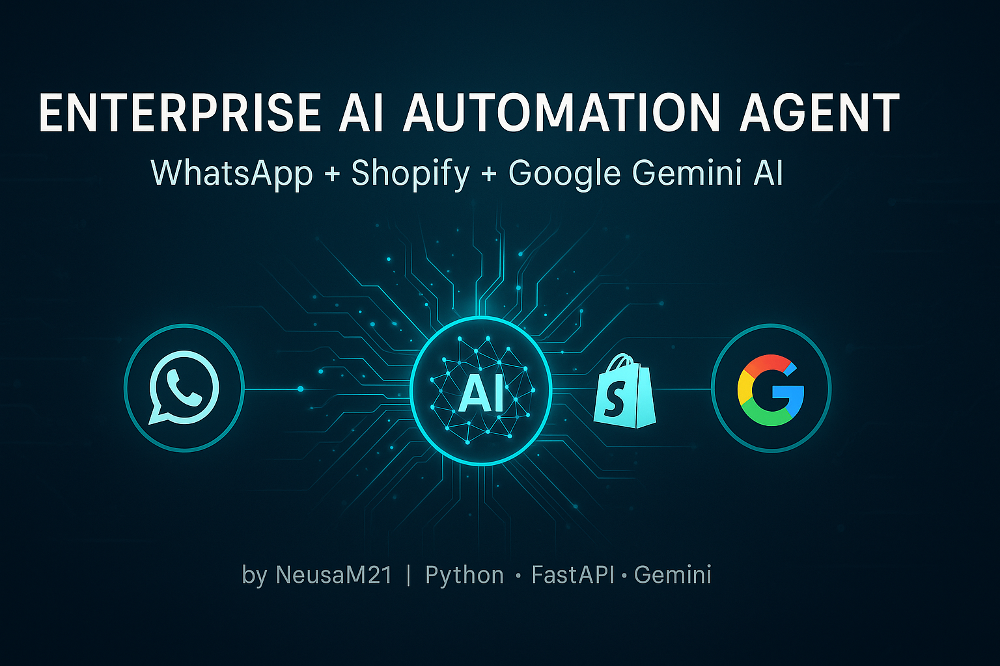

<p align="center"></p>

<hr style="border:0.5px solid #e5e5e5;margin:20px 0;">

<h2 align="center"><b>Enterprise AI Automation Agent</b></h2>

<p align="center">
  <b>WhatsApp + Shopify + Google Gemini AI</b><br>
  AI automation backend that connects <b>WhatsApp</b>, <b>Shopify</b>, and <b>Google Gemini</b> for e-commerce automation,<br>
  smart product assistance and intelligent conversations.
</p>

<p align="center">
  
  
  
  
  
  
</p>

<hr style="border:0.5px solid #e5e5e5;margin:20px 0;">

## 🧭 Table of Contents
- [✅ Feature Overview](#-feature-overview)
- [🧰 Tech Stack](#-tech-stack)
- [⚙️ How It Works](#how-it-works)
- [💻 Local Setup](#local-setup)
- [🔐 Environment (.env)](#environment-env)
- [▶️ Run Server](#run-server)
- [⚡ Canonical API Tests (PowerShell)](#canonical-api-tests-powershell)
- [📤 Expected Response](#expected-response)
- [🔥 Demo (Terminal)](#demo-terminal)
- [🛒 Shopify Example](#shopify-example)
- [💬 WhatsApp Webhook](#whatsapp-webhook)
- [📂 Project Structure](#project-structure)
- [🧩 Troubleshooting](#troubleshooting)
- [🧾 Common Errors Table](#common-errors-table)
- [🌐 Official Links](#official-links)
- [🇺🇸 Global Overview (English)](#global-overview-english)
- [🇧🇷 Visão Geral (Português)](#global-overview-portuguese)
- [🗺️ Roadmap](#roadmap)
- [👩‍💻 Author](#author)
- [📜 License](#license)

<hr style="border: 0.5px solid #e5e5e5; margin: 20px 0">

## ✅ Feature Overview

| Feature | Status | Description |
|----------|--------|-------------|
| AI Reply Engine (Gemini) | ✅ Done | Smart responses powered by Google Gemini |
| WhatsApp Integration | ✅ Done | Webhook + AI replies |
| Shopify Integration | ✅ Done | Product search by title |
| Error-safe AI Engine | ✅ Done | Timeout + fallback + model validation |
| REST API Docs | ✅ Done | Swagger ready |
| Slack Notifications | 🚧 Next | Team alerts from automation |
| AI Memory (/ai/messages) | 🚧 Next | Conversation history |
| Ecommerce AI Assistant | 🚧 Next | Smart product advisor |
| RAG for Knowledge Base | 🚧 Planned | Load product FAQ / docs |
| Dashboard UI | 🚧 Planned | Manage flows visually |

<hr style="border: 0.5px solid #e5e5e5; margin: 20px 0">

## 🧰 Tech Stack

| Area | Technology |
|------|-------------|
| Language | Python 3.11+ |
| Framework | FastAPI |
| AI Provider | Google Gemini |
| Ecommerce | Shopify API |
| Messaging | WhatsApp Cloud API |
| HTTP Client | httpx |
| ASGI Server | uvicorn |
| Environment | python-dotenv |

<hr style="border: 0.5px solid #e5e5e5; margin: 20px 0">

<a id="how-it-works"></a>
## ⚙️ How It Works
User (WhatsApp) → Webhook → Check Shopify Products  
↳ Found → Product response to user  
↳ Not Found → Ask Gemini AI → Smart reply to WhatsApp  

<hr style="border: 0.5px solid #e5e5e5; margin: 20px 0">

<a id="local-setup"></a>
## 💻 Local Setup
1. Clone the repository:  
   ```bash
   git clone https://github.com/NeusaM21/enterprise-ai-automation-agent.git
2. Enter the project folder: 
cd enterprise-ai-automation-agent
3. Create a virtual environment:  
python -m venv .venv 
4. Activate (PowerShell):  
.\.venv\Scripts\Activate.ps1
5. Install dependencies:
pip install -r requirements.txt 

🧩 Note: Requires Python 3.11+

<hr style="border: 0.5px solid #e5e5e5; margin: 20px 0">

<a id="environment-env"></a>

## 🔐 Environment (.env)

Create a .env file in the project root:

ENV=dev
HOST=127.0.0.1
PORT=8000

GEMINI_API_KEY=your_gemini_key
AI_MODEL=models/gemini-2.0-flash-001

SHOPIFY_API_KEY=your_key
SHOPIFY_PASSWORD=your_password
SHOPIFY_STORE_URL=shop-name.myshopify.com

WHATSAPP_TOKEN=your_meta_whatsapp_token
WHATSAPP_VERIFY_TOKEN=your_webhook_verify_token
WHATSAPP_PHONE_ID=your_whatsapp_phone_id


<hr style="border: 0.5px solid #e5e5e5; margin: 20px 0">

<a id="run-server"></a>

## ▶️ Run Server

Run locally:
uvicorn app.main:app --host 127.0.0.1 --port 8000 --reload
Access the Swagger documentation:
👉 http://127.0.0.1:8000/docs

<hr style="border: 0.5px solid #e5e5e5; margin: 20px 0">

<a id="canonical-api-tests-powershell"></a>

## ⚡ Canonical API Tests (PowerShell)

Before testing, make sure the FastAPI server is running.
If not:

- Press CTRL + C to stop the previous session.
- Activate venv: & .\.venv\Scripts\Activate.ps1
- Run: ./run.ps1 

Example tests

Invoke-RestMethod -Method Get -Uri "http://127.0.0.1:8000/health"
Invoke-RestMethod -Method Get -Uri "http://127.0.0.1:8000/ai/models"

$body = @{ text = "Hello Gemini, how are you?" } | ConvertTo-Json
Invoke-RestMethod -Method Post -Uri "http://127.0.0.1:8000/ai/ask" -ContentType "application/json" -Body $body


<hr style="border: 0.5px solid #e5e5e5; margin: 20px 0;">


<a id="expected-response"></a>

## 📤 Expected Response

```json
{
  "model": "models/gemini-2.5-flash",
  "fallback": false,
  "latency_ms": 210,
  "reply": "Hi! I'm great and ready to help! 😊"
}
```

💡 Tip: Add `timeout_ms` to handle slow responses and avoid retries.

<hr style="border: 0.5px solid #e5e5e5; margin: 20px 0">


<a id="demo-terminal"></a>

## 🔥 Demo (Terminal)

```bash
curl -X POST http://127.0.0.1:8000/ai/ask \
  -H "Content-Type: application/json" \
  -d "{\"text\":\"Say one fun fact about AI\"}"
```

<hr style="border: 0.5px solid #e5e5e5; margin: 20px 0;">


<a id="shopify-example"></a>

## 🛒 Shopify Example

GET http://127.0.0.1:8000/catalog/products?limit=5

<hr style="border: 0.5px solid #e5e5e5; margin: 20px 0;">


<a id="whatsapp-webhook"></a>

## 💬 WhatsApp Webhook

GET /webhook/whatsapp?hub.mode=subscribe&hub.verify_token=YOUR_TOKEN&hub.challenge=1234

Receive:  
POST /webhook/whatsapp

<hr style="border: 0.5px solid #e5e5e5; margin: 20px 0;">


<a id="project-structure"></a>

## 📂 Project Structure (Clean Architecture Ready)

This project follows a modular and scalable architecture to support future extensions such as conversation memory, Slack actions, RAG knowledge base, and persistent storage.  
The structure is clean and organized to make maintenance easy.

```plaintext
enterprise-ai-automation-agent
├─ app/
│  ├─ main.py                # FastAPI app and route definitions
│  ├─ services/              # External integrations: AI, Shopify, WhatsApp
│  ├─ utils/                 # Logger and shared helpers
│  ├─ config/                # Environment and global settings
│
├─ tests/                    # Automated tests
├─ assets/                   # Static project assets (images/banners)
│  └─ banner.png             # Project cover image used in README
│
├─ run.ps1                   # Local startup script for Windows PowerShell
├─ requirements.txt          # Python dependencies
└─ README.md                 # Project documentation
```

<hr style="border: 0.5px solid #e5e5e5; margin: 20px 0;">


<a id="troubleshooting"></a>

## 🧩 Troubleshooting

Issue | Fix  
------|------  
Connection refused | Start server: `./run.ps1`  
Model not found | Check `/ai/models` and `.env`  
Timeout | Add `timeout_ms` to `/ai/ask` body  
502 Error | Verify `GEMINI_API_KEY`  
CRLF/LF warning | Fixed with `.gitattributes`

<hr style="border: 0.5px solid #e5e5e5; margin: 20px 0;">


<a id="common-errors-table"></a>

## 🧾 Common Errors Table

Error | Possible Cause | Quick Fix  
------|----------------|-----------  
502 Bad Gateway | Invalid or missing `GEMINI_API_KEY` | Check `.env` and restart  
TimeoutError | Slow AI response | Add `timeout_ms` parameter  
Model Not Found | Wrong model name | Use `/ai/models` endpoint  
Connection Refused | Server not running | Execute `./run.ps1`  
CRLF/LF Warning | Windows line endings | Ensure `.gitattributes` set to LF  

<hr style="border: 0.5px solid #e5e5e5; margin: 20px 0;">


<a id="official-links"></a>

## 🌐 Official Links

- [Gemini AI Docs](https://ai.google.dev/)
- [WhatsApp API](https://developers.facebook.com/docs/whatsapp/)
- [Shopify API](https://shopify.dev/docs/api)
- [MIT License](https://opensource.org/licenses/MIT)

<hr style="border: 0.5px solid #e5e5e5; margin: 20px 0;">


<a id="global-overview-english"></a>

## 🇺🇸 Global Overview (English)

This project is an AI-powered automation agent for e-commerce that connects:

🟢 **WhatsApp** → AI-driven customer interactions  
🟢 **Shopify** → Product search and management  
🟢 **Gemini AI** → Smart reasoning and adaptive replies  

You can automate customer service, sales flows, and chat responses using this system.

<hr style="border: 0.5px solid #e5e5e5; margin: 20px 0;">


<a id="global-overview-portuguese"></a>

## 🇧🇷 Visão Geral (Português)

Este projeto é um agente de automação com IA para e-commerce. Ele integra:

🟢 **WhatsApp** → Atendimento automático com IA  
🟢 **Shopify** → Busca e recomendação de produtos  
🟢 **Gemini AI** → Respostas inteligentes e contexto conversacional  

Use para criar automações reais de suporte, vendas e chat inteligente.

<hr style="border: 0.5px solid #e5e5e5; margin: 20px 0;">


<a id="roadmap"></a>

## 🗺️ Roadmap

✅ Slack alerts (soon)  
✅ AI conversation memory  
✅ RAG for store FAQ  
✅ Product recommendations  
✅ Web dashboard (visual builder)

<hr style="border: 0.5px solid #e5e5e5; margin: 20px 0;">


<a id="author"></a>

## 👩‍💻 Author

Developed by **Neusa M. — AI Automation Engineer**  

📧 [contact.neusam21@gmail.com](mailto:contact.neusam21@gmail.com)  
💻 [github.com/NeusaM21](https://github.com/NeusaM21)  
🌐 [linkedin.com/in/NeusaM21](https://www.linkedin.com/in/NeusaM21)

<hr style="border: 0.5px solid #e5e5e5; margin: 20px 0;">


<a id="license"></a>

## 📜 License

This project is licensed under the [MIT License](LICENSE)  
— free for commercial and academic use.

<hr style="border: 0.5px solid #e5e5e5; margin: 20px 0">


---


<p align="left">
  <a href="https://github.com/NeusaM21">
    
  </a>
</p>
